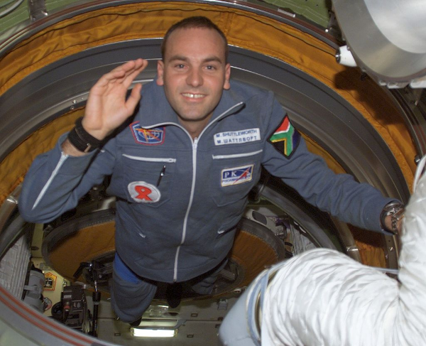

# A person who I admire

I admire Mark Shuttleworth – the second space tourist. The full name of Mark is Mark Richard Shuttleworth. He is famous mainly as a man behind 
Ubuntu – the most popular Linux distribution in the world. I am even writing this essay under Ubuntu 16.04.4 LTS (Xenial Xerus).  Mark was born 
on 18 September 1973 and become the first citizen of an independent African country who traveled to space as a space tourist.  He lived on the 
Isle of Man and holded a dual citizenship from South Africa and the United Kingdom. Shuttleworth obtained a Bachelor of Business Science degree 
in Finance and Information Systems at the University of Cape Town, where he lived in Smuts Hall. As a student, he became involved in the installation 
of the first residential Internet connections at the university. 
:boom: In the 1990s, Shuttleworth participated as one of the developers of the Debian operating 
system. 
:boom: In 1995 he founded Thawte Consulting, a currently running company which specialized in digital certificates and Internet security. 
:boom: In December 1999, Thawte was acquired by VeriSign, earning Shuttleworth 3.5 billion South African rand (about US $575 (equivalent to $844.70 in 2017) million). 
:boom: In September 2000, Shuttleworth formed HBD Venture Capital (Here be Dragons), a business incubator and venture capital provider. 
:boom: He gained worldwide fame on 25 April 2002, as the second self-funded space tourist and the first-ever South African in space. 
Flying through Space Adventures, he launched aboard the Russian Soyuz TM-34 mission as a spaceflight participant, paying approximately US$20,000,000 for 
the voyage. Two days later, the Soyuz spacecraft arrived at the International Space Station, where he spent eight days participating in experiments
 related to AIDS and genome research.
:boom: On 5 May 2002, he returned to Earth on Soyuz TM-33. In order to participate in the flight, Shuttleworth had to 
 undergo one year of training and preparation, including seven months spent in Star City, Russia.
 While in space he had a radio conversation with Nelson Mandela and a 14-year-old South African girl, Michelle Foster, who asked him to marry her. He politely 
 dodged the question, stating that he was "very honored at the question" before changing the subject  This is picture on Mark on on board the International Space Station. 
:boom: In March 2004 he formed Canonical Ltd., for the promotion and commercial support of free software projects, especially the Ubuntu operating system.

This is Mark picture on board the International Space Station:

You can readk more about Mark here:
http://www.markshuttleworth.com/
